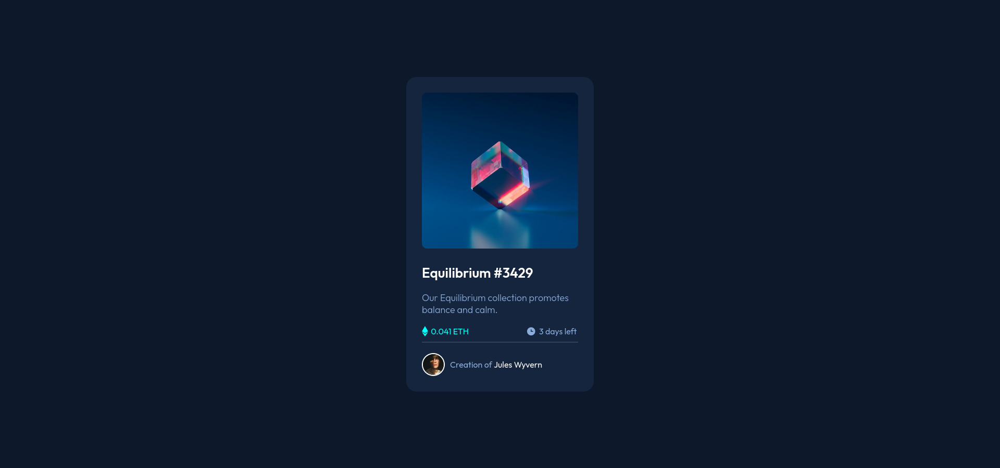

# Frontend Mentor - NFT preview card component solution

This is a solution to the [NFT preview card component challenge on Frontend Mentor](https://www.frontendmentor.io/challenges/nft-preview-card-component-SbdUL_w0U). Frontend Mentor challenges help you improve your coding skills by building realistic projects. 
### Screenshot

### Links

- Solution URL: [Click Here!](https://github.com/basilaiageorgee/nft-preview-card)
- Live Site URL: [Click Here!](https://basilaiageorgee.github.io/nft-preview-card/)

### Built with

- Semantic HTML5 markup
- CSS custom properties
- Flexbox
- [React](https://reactjs.org/) - JS library
